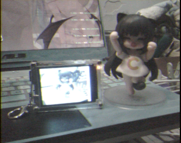
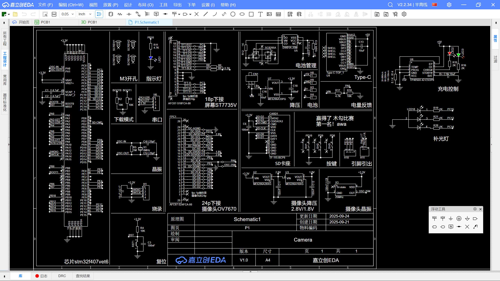
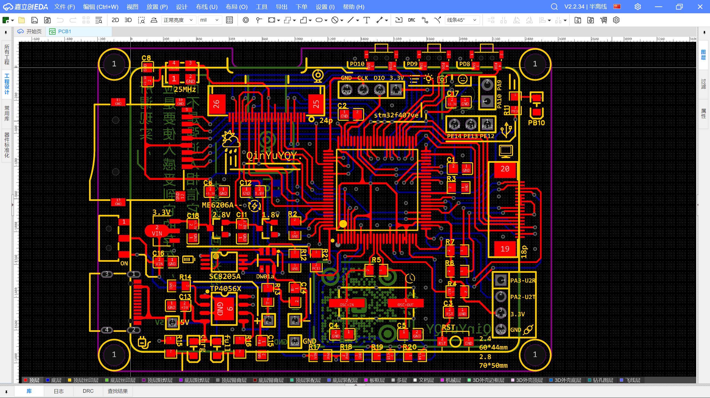
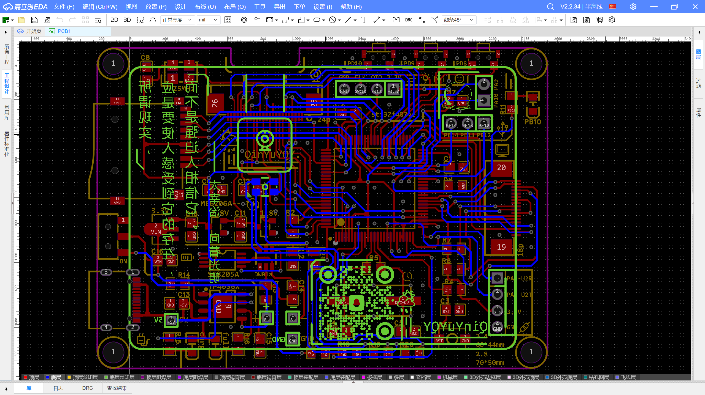

# *2025/9/13-16:05*    
****	
&nbsp;&nbsp; 打算开发摄像头之类的内容   
板子用的暂且还是f4_ui的板子

   

# *2025/11/14-14:41*  
****
&nbsp;&nbsp; ~~真的用了两个月来处理......~~   
>	所谓现实，    
>	应是要使人感受到它的存在，    
>	而不是强迫人相信它。    
>	&nbsp;&nbsp;&nbsp;&nbsp;——太宰治 津轻    

使用**STM32F4xxVET6**制作的一台小相机，  
电路板尺寸70 * 50mm ,    
屏幕是ST7735V驱动的320 * 240屏幕，    
摄像头OV7670，外接25MHz有源晶振，分辨率约304 * 240.

## 效果图

  

## 成本

stm32f429vet6 ——8r       
tft屏幕st7735 ——12r    
摄像头ov7670 ——10r    
电池523450|1050毫安 ——8.5r    
SD卡 ——6.8r     
电路板 ——4r    
其他 ——10r

**总计约60r**

## 代码结构

## 电路板

      
      
      

